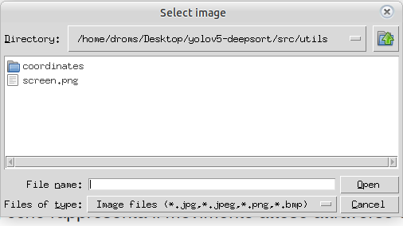
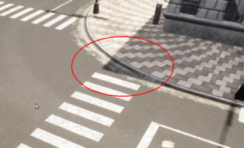
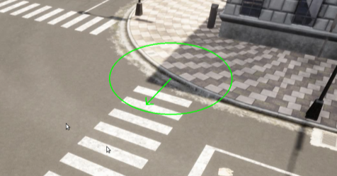

# yolov5-deepsort


Questo progetto è un’implementazione open-source di un sistema per il rilevamento e l’allerta dell’attraversamento da parte di utenti deboli della strada (VRU), basato su YOLOv5 per la rilevazione degli oggetti e DeepSORT per il tracciamento multi-oggetto.
L’obiettivo principale è migliorare la sicurezza stradale identificando quando un utente debole della strada (ad esempio un pedone in sedia a rotelle) sta avvicinando o sta tentando di attraversare la strada, generando avvisi tempestivi.
YOLOv5 viene utilizzato per rilevare i VRU in ogni frame video, mentre DeepSORT ne traccia i movimenti nel tempo, assegnando ID univoci.
Il progetto è implementato in Python utilizzando il framework di deep learning PyTorch.


<p align="center">


</p>

## Dipendenze 
Per eseguire il codice, è necessario installare le seguenti dipendenze

* ultralytics 
``` bash
pip install ultralytics
```
* deep-sort-realtime 1.3.2
``` bash
pip install deep-sort-realtime
```
* [pytorch](https://pytorch.org/) - Per avere il supporto di CUDA con pytorch installare la versione più recente sulla base della versione di CUDA utilizzata dal proprio sistema. 

La lista delle dipendenze per il progetto può essere trovata nel file [environment.yml](environment.yml).

Per ricreare l'environment utilizzato per lo sviluppo del codice, è possibile creare un ambiente conda utilizzando il file environment.yml appositamente fornito:
``` bash
conda env create -f environment.yml
```
Questo script creerà un ambiente denominato yolov5-deepsort con tutti i pacchetti necessari installati. Una volta creato, è possibile attivare l'ambiente con il seguente comando:

``` bash
conda activate yolov5-deepsort
```
Una volta attivato l'ambiente, sarà possibile eseguire gli script del progetto e utilizzare i pacchetti elencati in precedenza.


## Struttura delle directory 

```bash
yolov5-deepsort
├── main.py
├── src
    └── dataloader.py
    └── detector.py
    └── tracker.py
    └── utils.py
    └── geom_utils.py
    ├── utils
         └── select_area.py
         ├── coordinates
             └── file.npy
├── models      
├── data
├── input_videos
├── outputs
├── environment.yml
├── config.yml
├── README.md


``` 


## Esseguire il progetto
#### Step 1: Assumendo che tutte le dipendenze siano state installate e che l'ambiente sia attivo, clonare la repository.

``` bash
git clone https://github.com/nfloris/vru_crossing_detection

```

### Step 2: Impostare una sorgente video
Accedere al codice sorgente dalla cartella *src* del repository. Dal file **config.yml** è possibile impostare una serie di parametri di configurazione del progetto. Per impostare una sorgente video, è necessario modificare il parametro **input_path** dalla sezione **dataloader**.
Per comodità, tutti i video di input sono posizionati nella cartella *input_videos* del repository.

### Step 2: Selezione geometrica delle aree in prossimità degli attraversamenti pedonali
Per consentire al sistema di generare allarmi per pedoni in procinto di attraversare, è necessario fornire alcune informazioni preliminari sulla configurazione dello scenario, specificando le coordinate delle aree adiacenti agli attraversamenti pedonali.

A questo scopo è disponibile lo script src/utils/select_area.py, che consente di disegnare manualmente i contorni geometrici delle aree di interesse direttamente su una schermata. Dopo aver eseguito il comando:
```bash
python3 select_area.py
```

si aprirà una finestra di selezione in cui caricare un’immagine (formati supportati: png, jpg, jpeg, bmp), corrispondente a un frame o a una cattura dello scenario da analizzare.

Con un click destro del mouse è possibile inserire un’area centrata nel punto selezionato. Tenendo premuto e trascinando, se ne possono regolare dimensioni, larghezza e altezza. Al rilascio del tasto, l’area rimane modificabile per rotazione e angoli iniziale/finale tramite i comandi da tastiera riportati di seguito:

 - a/d → rotazione verso sinistra/destra
 - w/e → modifica angolo iniziale/finale (permette di tracciare semicerchi)
 - tasti direzionali → spostamento lungo assi x e y
 - ENTER → conferma dell’area
 - r → reset


Dopo la conferma con ENTER, è possibile assegnare la direzione di percorrenza prevista, cche rappresenta il movimento atteso attraverso quell’area e deve coincidere con la direzione dell’attraversamento pedonale a cui essa fa riferimento. Una freccia direzionale indicherà il verso di attraversamento ed è regolabile tramite i tasti a/d o trascinamento con il mouse. La conferma avviene con ENTER o doppio click destro. Per annullare l’inserimento di un’area è sufficiente premere r.

Al termine della configurazione, le informazioni geometriche vengono salvate in un file con estensione .npy. Il percorso di questo file va indicato nel parametro area_coordinates_path della sezione dataloader del file config.yml. Per comodità, tutti i file contenenti le coordinate sono raccolti nella cartella src/utils/coordinates del repository.

*Attenzione*: la dimensione della schermata e dei frame delle registrazioni corrispondenti devono coincidere.

### Step 3: Eseguire il file main.py 
```bash
python3 main.py

```

## Risultati 

Dei risultati di esempio sono consultabili all'interno della cartella *outputs*


## Miglioramenti futuri

1. Sono previsti ulteriori addestramenti dei modelli per migliorare le performance dell'Object Detection.
2. Arricchimento del dataset utilizzato.
3. Nuovi esperimenti su ulteriori utenti deboli della strada.
4. Esperimenti su ulteriori scenari sintetici e esperimenti sul campo.
5. Post-processing dei rilevamenti e dei tracciamenti in modo da migliorare le prestazioni complessive del sistema


   
## References

* [YOLO Algorithm](https://arxiv.org/abs/1506.02640)
* [DeepSORT code repository](https://github.com/nwojke/deep_sort)
* [DATASET](https://universe.roboflow.com/yolotest-vzrks/person-mm3cw)
